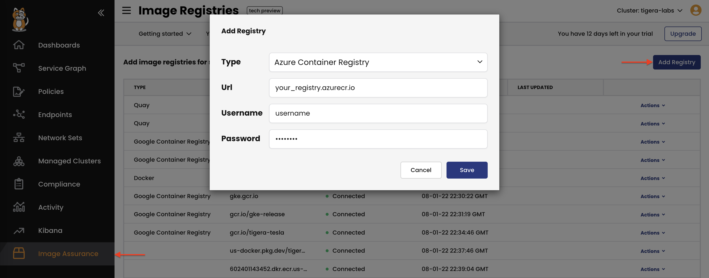
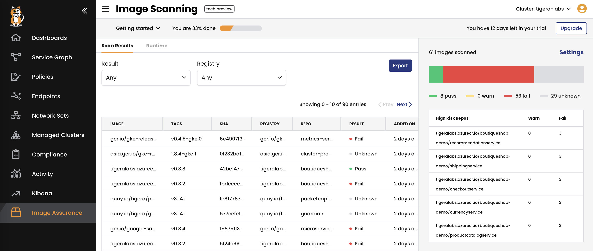

# Module 4: Connect image registry

**Goal:** Add image registry to Calico Cloud management plane.

>In the instructor-led workshop, you will be provided with the credentials to access the Azure Container Registry. When following this workshop in a self guided setting, you will need to configure and connect your own container registry.  
The workshop uses [microservices-demo](https://github.com/GoogleCloudPlatform/microservices-demo) images of versions `v0.3.2` and `v0.3.8`. In the self guided workshop setting you will need to build and push those images to your image registry and then adjust demo application manifests to reference your image registry.

## Steps

1. Connect container image registry to Calico Cloud management plane.

    >Refer to [Calico Cloud documentation](https://docs.calicocloud.io/image-assurance/scan-image-registries#create-access-to-image-registries) to see a list of supported image registries.

    Navigate to `Image Assurance` > `Image Registries` view and add image registry.

    >During instructor-led workshop, you will be provided with an image registry. For the self-guided workshop, use your own image registry.

    

2. Explore image scanning results.

    >Once registry is added, Calico Cloud will start scanning images from the registry. It can take several minutes for the images to be scanned.

    Navigate to `Image Assurance` > `Scan Results` to view image scanning results.

    

---
[Next -> Module 5](../modules/configure-demo-resources.md)
